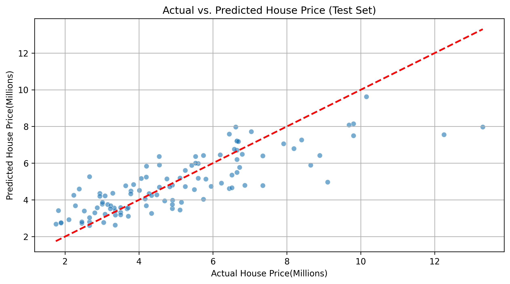

# House-Price-Prediction-Analysis

This project explores how different housing characteristics influence property prices using data analysis and multiple linear regression. The goal of the project is to understand which features contribute most to housing value and to build a model capable of estimating house prices based on those features.

The dataset contains 545 housing records with variables such as area, number of bedrooms, number of bathrooms, number of stories, parking availability, air conditioning, preferred location, and other structural or facility related attributes. These variables were used to predict the final house price.

The workflow of this project follows a standard data science process. The dataset was first inspected and cleaned to ensure there were no missing values or incorrect data types. Several categorical features such as main road access, guest room availability, basement presence, air conditioning, hot water heating, and preferred area were converted into numerical form to make them suitable for modeling.

Exploratory data analysis was then performed to understand the distribution of house prices and how individual features relate to the target variable. Visualizations were used to observe patterns and potential relationships between housing characteristics and price.

After the exploratory stage, the dataset was split into training and testing sets in order to evaluate the model properly. A multiple linear regression model was trained using several housing attributes including area, bedrooms, bathrooms, stories, parking, and other housing facilities.

The model was evaluated using Mean Absolute Error and R squared scores. The results show that the model explains a significant portion of the variation in housing prices while maintaining consistent performance between training and testing data. This indicates that the model generalizes reasonably well to unseen data.

Feature importance was also analyzed using regression coefficients to understand which housing characteristics influence prices the most. The analysis shows that factors such as house area, number of bathrooms, air conditioning availability, and location preference have strong effects on housing value.

This project demonstrates a complete regression analysis workflow including data inspection, feature preparation, model training, prediction, and evaluation. It provides a practical example of how machine learning techniques can be used to estimate property prices and understand the factors that drive housing value.

Technologies used in this project include Python, Pandas, NumPy, Matplotlib, Seaborn, and Scikit learn.

# Environment Setup

To run this project locally, install the required Python libraries using the following command
pip install -r requirements.txt
This will install all the libraries required to reproduce the analysis and model results.

```
house-price-prediction-analysis
│
├── data
│   Housing.csv
│
├── notebook
│   house_price_analysis.ipynb
│
├── images
│   actual_vs_predicted.png
│
├── requirements.txt
│
└── README.md
```
The **data** folder contains the dataset used for the analysis.
The **notebook** folder contains the Jupyter notebook where the entire workflow was implemented including data exploration, modeling, and evaluation.

# Sample Output and Visualizations

Several visualizations were created during the analysis to better understand the housing dataset and evaluate the performance of the regression model.

The distribution of house prices was examined to observe how prices are spread across the dataset. An actual versus predicted house price scatter plot was used to assess how closely the model predictions align with real housing prices. Feature importance was also analyzed to identify which housing characteristics contribute the most to price variation. In addition, a residual plot was used to inspect model errors and check whether the regression assumptions were reasonably satisfied.

The visualization below shows the relationship between the actual house prices and the predicted prices generated by the model.


# Challenges Encountered and Lessons Learned

During the development of this project, several issues were encountered while exploring the dataset, building the regression model, and preparing the features. These challenges helped deepen the understanding of data preprocessing and model evaluation.

One issue occurred during the train and test split of the dataset. The initial code mistakenly used a training size of 0.2 while the intention was to train the model on 80 percent of the data. This resulted in the model learning from a very small portion of the dataset while being evaluated on a much larger portion. After reviewing the code, the split was corrected to use test_size = 0.2, which allowed the model to train on 80 percent of the data and improved the model’s stability.

Another challenge occurred while converting categorical data into numerical format. The furnishingstatus column contained categories such as furnished, semi furnished, and unfurnished. One hot encoding was applied using pandas get_dummies to transform this column into numerical features suitable for regression. During this step, the generated columns contained boolean values True and False instead of numeric values. An attempt was initially made to map string values 'True' and 'False' to integers, which produced missing values because the actual data type was boolean. The issue was resolved by converting the boolean columns directly to integers using astype(int).

A formatting issue was also observed when displaying prediction results. The predicted values appeared in scientific notation such as 7.505157e+06, which initially looked incorrect. After investigation, it was understood that this was simply a display format used by Python for large numbers and not an error in the model output.

Another challenge involved sorting regression coefficients after rounding them. At one point the dataframe containing the coefficients was unintentionally converted into a pandas Series, which caused an error when attempting to sort using a column name. The issue was corrected by modifying only the coefficient column instead of replacing the entire dataframe.

These challenges helped strengthen understanding of dataset preparation, feature encoding, and model evaluation. They also highlighted the importance of checking data types, verifying assumptions in code, and carefully reviewing preprocessing steps when building machine learning models.

## Author

Nnamani Ugochukwu Anthony
https://www.linkedin.com/in/ugochukwu-nnamani-9b3a27255/

Data Scientist and Machine Learning Engineer
